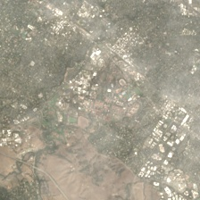

# Tutorial: Landsat-8 image download and visualization using Google Earth Engine and Python

In this tutorial I want to explain how to download and visualize Landsat-8 images using GEE and Python packages. I wrote this code originally for my ["Using satellite and street level images to predict urban emissions"](https://github.com/nicolas-suarez/urban_emissions/) project, and we struggled to download images in a simple way, and that's why I'm writing this tutorial. You can find the actual Jupyter notebook with this example and the proper outputs in [this link](https://github.com/nicolas-suarez/landsat_8_tutorial/blob/main/landsat_8_tutorial_download.ipynb).

## Initial set-up

We start by importing some packages. Besides installing the packages, we also need a Google-Earth Engine account to use the `ee` package.

```python
import os
import numpy as np
import pandas as pd
import pickle
import time
import math
import requests, zipfile, io
from geetools import cloud_mask
from IPython.display import Image

#importing Earth Engine packages
import ee #install in the console with "pip install earthengine-api --upgrade"
ee.Authenticate()  #every person needs an Earth Engine account to do this part
ee.Initialize()
```
## Defining satellite images

Here we are going to define our satellite images. In this example, we are going to use the Landsat-8 Surfarce reflectance Tier 1 image collection, containing all the images taken during 2020, and using the 3 RGB  bands for this example.

Here we are also going to apply a mask to the pixels with the `cloud_mask` function from the [geetools package](https://pypi.org/project/geetools/). The mask allow us to exclude from our collection all the pixels that were covered by clouds, snow or similar sources of interference from an image. Since we are working for the moment with an image collection, we use the `map()` function to individually apply the mask to all the elements in the collection.

```python
#defining image
startDate = '2020-01-01'
endDate = '2020-12-31'
landsat = ee.ImageCollection("LANDSAT/LC08/C01/T1_SR")
# filter date
landsat = landsat.filterDate(startDate, endDate) 
#applying cloud masking
landsat_masked=landsat.map( cloud_mask.landsatSR(['cloud']) )
#selecting bands
landsat_masked=landsat_masked.select(["B2","B3","B4"])
landsat = landsat.select(["B2","B3","B4"])
```

## Function to define task or downloading image directly

After doing this, I'm going to define a function to download imagery called `image_task`. This function download satellite images centered around a point defined by latitude and longitude coordinates, with a certain size, and allows us to store them either on a Google Drive folder, Google Cloud bucket or locally.

We start by defining `len`, the total size of the image in meters, that is computed as the product of the resolution of our Landsat-8 SR images (30 meters) and the number of pixels we want to capture in the image. After that, we generate a circle around the point of interested, using as the radius half of our `len` parameter, and then we put a bounding box around the circle to get a square. We extract the coordinates of the bounding box and pass them to a `ee.Geometry.Rectangle` object called `rectangle`.

After that, we only need to crop our `rectangle` object from our satellite image, called `image` here. Here, our image is going to be our previously defined `ee.ImageCollection` object containing our `Landstat-8 SR` satellite images. We are going to clip our `rectangle` area using the `filterBounds()` method, and then we use the `mean()` function to obtain a mean-composite of the images in the `ImageCollection` for the specified area. We also need to define the `region` where we are working (which is essentially the same as our `rectangle`), and the dimensions of our image (the number of pixels for the width and height).

Finally, the last step depends on how we want to download our images:

- If we want to work locally with our files, then we are going to generate a download URL for our image in TIFF format, with the `ee.Image.getDownloadURL()` method. We then use `requests`, `zipfile` and `io` to download the image as a ZIP file, decompress it and store it a local folder.

- If we want to work with cloud services, like Google Drive or Google Cloud, which is more reliable when we work with large volumes of images, then we are going to use `ee.batch.Export.image.toCloudStorage()` or `ee.batch.Export.image.toDrive()` to create a Google Earth engine `task` with specifications of what kind of image we want, and then we use `task.start()` to start the task, and the images are going to appear in the specified cloud folders. We can also check the status of the task to see if the images were downloaded succesfully or not.

```python
def image_download(image,point,image_res,n_pixels,folder_name, image_name, storage="local"):
    
    """
    Function to download satellite images from a ee.imageCollection object.
    We first generate a bounding box of image_res*n_pixels meters around "point",
    then we clip that region from the image collection, take the mean image from the collection,
    and send that as a task to the Google Earth Engine. 
    After that, we download the image Google Cloud Storage if storage=="Cloud", 
    to Google Drive if storage=="Drive" or to a local folder if storage=="local".
    
    Inputs:
    -image= ee.ImageCollection object
    -point= ee.Geometry.Point object
    -image_res= resolution of the image in meters
    -n_pixels= number of pixels to extract on the images
    -storage= string indicating if we are storing the images in Google Cloud,Google Drive or locally.
              Defaults to local storage.
    -folder_name= string with Google Cloud bucket name if storage=="Cloud"
                  string with the name of a folder in the root of Google Drive if storage=="Drive"
                  string with the path to the image if storage=="local"
    -image_name= string with the image_name for the TIFF image.

    Output:
     When storage=="Cloud" or storage=="Drive":
     -task= an EE task object. we can then use task.status() to check the status of the task.
     If the task is completed, we will see a TIFF image in "folder_name" with name "image_name.tif".
     The image has 3 dimensions, where the first 2 are n_pixels, and the 3rd is the number of bands of "image".
     When storage=="local":
     -there is no output, but we will see one TIFF file per band of our image in the folder "folder_name".
    """
    #generating the box around the point
    len=image_res*n_pixels # for landsat, 30 meters * 224 pixels
    region= point.buffer(len/2).bounds().getInfo()['coordinates']
    #defining the rectangle
    coords=np.array(region)
    #taking min and maxs of coordinates to define the rectangle
    coords=[np.min(coords[:,:,0]), np.min(coords[:,:,1]), np.max(coords[:,:,0]), np.max(coords[:,:,1])]
    rectangle=ee.Geometry.Rectangle(coords)

    if storage=="Cloud":
        #generating the export task (dimensions is "WIDTHxHEIGHT")
        task=ee.batch.Export.image.toCloudStorage(image=image.filterBounds(rectangle).mean(), 
                            bucket=folder_name, 
                            description=image_name, 
                            region=str(region), dimensions=str(n_pixels)+"x"+str(n_pixels))
        #starting the task
        task.start()
        return task
    
    if storage=="Drive":
        #generating the export task (dimensions is "WIDTHxHEIGHT")
        task=ee.batch.Export.image.toDrive(image=image.filterBounds(rectangle).mean(), 
                            folder=folder_name, 
                            description=image_name, 
                            region=str(region), dimensions=str(n_pixels)+"x"+str(n_pixels))
        #starting the task
        task.start()
        return task
    
    if storage=="local":
        #downloading the image
        r=requests.get( image.filterBounds(rectangle).mean().getDownloadURL({
                            'name': image_name, 
                            'region': str(region),
                            'dimensions': str(n_pixels)+"x"+str(n_pixels)}))
        #unzip it to the selected directory
        z = zipfile.ZipFile(io.BytesIO(r.content))
        z.extractall(folder_name)
```

## Testing our function
To test how our function works, we are going to create a little example, taking a 6.72 by 6.72 km satellite image around the Oval in Stanford campus, and storing it locally:

```python
#defining the oval as a point
oval=ee.Geometry.Point(-122.169678,37.429154)

#running our function
image_download(image=landsat,point=oval,image_res=30,n_pixels=224,folder_name='LS8_images', image_name='test_image', storage="local")
```

Now we are going to test that the images were indeed downloaded to the `LS8_images` folder:
```python
os.listdir('LS8_images')
```

We indeed see that there are 3 files in our folder, one for each channel of the image.

We could further work with this images. For instance, we can use packages like imageio to read the images in Python, read them into a numpy array and then use numpy functions like stack to stack all individual images into one big array.

# Visualizing images

To visualize images, we are going to do very similar things to what we did before. I will generate the satellite images in almost the same way I did before, but now we are going to add some visualization parameters, `visParams` to properly see our images. 

We are going to obtain a `jpg` image using the `ee.Image.getThumbUrl()`function, and we are going to visualize directly here. The function programmed below allow us to decide if we want to see a cloud masked version of the image or the regular one.

The visualization parameters and the image size are defined here, but could be modified if we wanted.

```python
#defining parameters for the function
image_res=30
n_pixels=224

#visualization parameters
visParams={'min': 0, 'max': 3000, 'gamma': 1.4,  
           'bands' : ['B4', 'B3', 'B2'], 'dimensions' : str(n_pixels)+"x"+str(n_pixels),
           'format' : 'jpg'}

#defining the function
def visualization(point,name,mask=True):
    '''
    Function to visualize the images for our ML application.
    Inputs:
        -point= ee.Geometry.point object
        -name: name that is going to be given to the jpg file
        -mask: True to get masked image, False to get unmasked image
    Outputs:
        The function doesn't produce an output, but generates a file called
        "name.jpg" in the current directory
    '''
    #computing bounding box
    len=image_res*n_pixels # for landsat, 30 meters * 224 pixels
    region= point.buffer(len/2).bounds().getInfo()['coordinates']
    coords=np.array(region)
    coords=[np.min(coords[:,:,0]), np.min(coords[:,:,1]), np.max(coords[:,:,0]), np.max(coords[:,:,1])]
    rectangle=ee.Geometry.Rectangle(coords)
    
    #clipping the area from satellite image
    if mask==True:
        clipped_image= landsat_masked.mean().clip(rectangle)
    else:
        clipped_image= landsat.mean().clip(rectangle)
        
    #getting the image
    requests.get(clipped_image.getThumbUrl(visParams))
    open(name+'.jpg', 'wb').write(requests.get(clipped_image.getThumbUrl(visParams)).content)
```
Now we are going to test the code. First we will visualize our image around the Oval without cloud masking:

```python
visualization(point=oval,name='oval_no_mask',mask=False)
Image(filename='oval_no_mask.jpg') 
```


And now we are going to visualize our image applying cloud masking:

```python
visualization(point=oval,name='oval_cloud_masking',mask=True)
Image(filename='oval_cloud_masking.jpg') 
```

